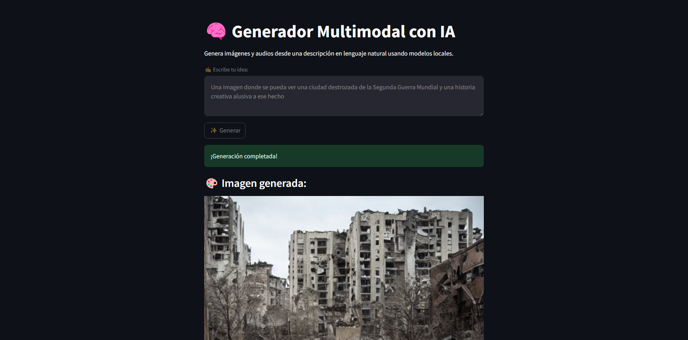
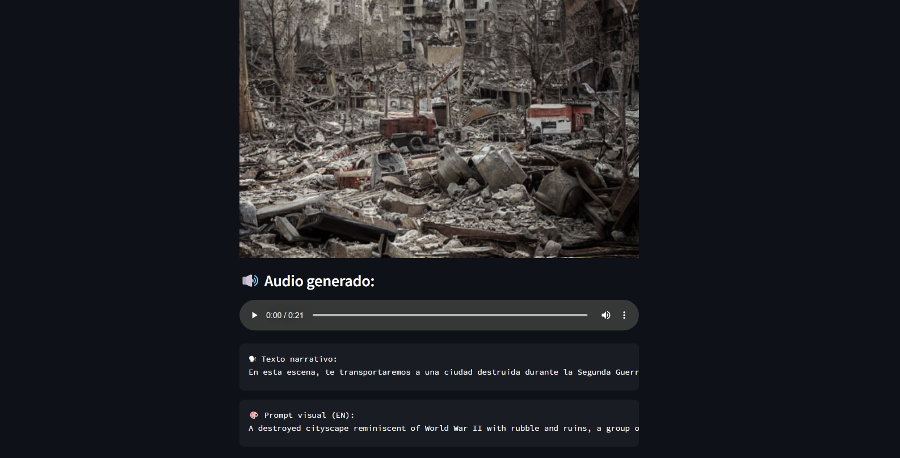

# Generador de Imagen y Audio con Agente IA

Este proyecto combina generación de imágenes con Stable Diffusion, audio con Edge-TTS y agentes LLM usando LangChain. Utiliza Streamlit como interfaz gráfica.

## Vista previa del proyecto

### 🧠 Interfaz principal


### 🎨 Imagen generada y audio narrativo



## Requisitos

Antes de ejecutar la aplicación, asegúrate de cumplir con los siguientes requisitos:

- Python 3.9 o superior
- [LM Studio](https://lmstudio.ai/) instalado
- Modelo cargado en LM Studio: **Mistral 7B Instruct v0.3**
- Archivo `.env` con la configuración necesaria (si aplica)

## Instalación

1. Crea y activa un entorno virtual (Se puede Anaconda):

```bash
python -m venv venv
# En Windows
venv\Scripts\activate
# En Mac/Linux
source venv/bin/activate
```

2. Instalación de dependencias
   
```bash
pip install edge-tts diffusers torch python-dotenv langchain openai streamlit pillow
```

3. Ejecución
   
```bash
streamlit run AppStreamlit.py
```

4. Recomendaciones extra

Para un mejor rendimiento y mayor velocidad de procesamiento, se recomienda contar con una tarjeta gráfica (GPU) compatible, con el fin de aprovechar la aceleración por hardware mediante CUDA.